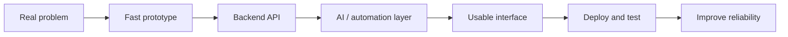

<div align="center">


<br>

<a href="mailto:manojkchandrashekar@gmail.com"></a>
<a href="https://linkedin.com/in/manoj-kumar-c-"></a>
<a href="https://github.com/ManojKumarC0112"></a>
<a href="https://instagram.com/Formalfuss"></a>

<br><br>


</div>

---

<div align="center">

### 🔎 Quick Navigation

[Recruiter Scan](#-recruiter-scan) •
[Featured Work](#-featured-work) •
[Tech Arsenal](#-tech-arsenal) •
[GitHub Intelligence](#-github-intelligence) •
[Current Mission](#-current-mission) •
[Connect](#-connect)

</div>

---

## 🎯 Recruiter Scan

> Backend-focused developer building practical software across **AI, automation, IoT, agriculture tech, assistive technology, and full-stack systems**.

| Signal | Details |
| --- | --- |
| **Primary lane** | Backend engineering + AI-powered product systems |
| **Core stack** | Python, Django, FastAPI, APIs, databases |
| **Product areas** | AgriTech, assistive tech, IoT, automation, full-stack apps |
| **Build style** | Prototype fast, validate the idea, then improve reliability and UX |
| **Career direction** | Strong software engineer capable of building useful, scalable products |

### What I Optimize For

| Backend Depth | AI Product Thinking | Prototype Velocity | System Design |
| --- | --- | --- | --- |
| APIs, auth, databases, deployment | ML features tied to real workflows | Hackathon-speed execution | Cleaner architecture and maintainability |

### Engineering Strengths

| Area | Signal | What I Bring |
| --- | --- | --- |
| APIs |  | Clean contracts, validation, auth, integrations |
| Django / FastAPI |  | REST APIs, backend services, production-oriented patterns |
| Machine Learning |  | Useful ML features, data workflows, model integration |
| System Design |  | Architecture, reliability, maintainability |
| Full-Stack Apps |  | Usable interfaces connected to real backend logic |

---

## 🧭 Build Map



| I Like Building | Why It Matters |
| --- | --- |
| **AI assistants** | Turn messy user needs into useful decisions |
| **Backend systems** | Make products reliable, secure, and maintainable |
| **IoT prototypes** | Connect software with physical-world problems |
| **Dashboards and workflows** | Make complex data easier to act on |
| **Hackathon products** | Compress idea, execution, and demo into one cycle |

---

## 🚀 Featured Work

| Project | Snapshot | Focus |
| --- | --- | --- |
| **🌾 Krishi Sakhi** | AI-powered agriculture assistant for practical farmer support and decision-making | AI, backend APIs, agriculture tech |
| **🦯 Smart Cane** | Assistive technology concept for visually impaired users using sensor-driven thinking | IoT, accessibility, embedded systems |
| **⚡ Hackathon Builds** | Fast idea-to-demo prototypes using APIs, automation, AI integrations, and full-stack workflows | Rapid prototyping, full-stack systems |

<details>
<summary><b>What makes a project worth pinning on my profile</b></summary>

```text
1. Clear problem statement
2. Working demo or screenshots
3. Clean README with setup steps
4. Backend/API architecture explained
5. Real-world use case, not just tutorial code
```

</details>

---

## 🧰 Tech Arsenal

<div align="center">

### Core Stack


</div>

### Skill Matrix

| Area | Tools | What I Use Them For |
| --- | --- | --- |
| **Backend** | Python, Django, Django REST, FastAPI, Flask, Node.js | APIs, auth flows, services, integrations |
| **Frontend** | JavaScript, Next.js, HTML, Tailwind CSS | Product UI, dashboards, full-stack apps |
| **AI / ML** | NumPy, Pandas, scikit-learn, TensorFlow, PyTorch, OpenCV | ML workflows, computer vision, data processing |
| **Databases** | PostgreSQL, MySQL, MongoDB, Redis, SQLite | Persistence, caching, relational and document data |
| **Cloud / DevOps** | Docker, Vercel, Render, AWS, Azure, Google Cloud | Deployment, hosting, environment setup |
| **IoT / Hardware** | Arduino, Raspberry Pi, sensors | Physical prototypes and assistive systems |

<details>
<summary><b>Expanded Toolbelt</b></summary>


</details>

---

## 📊 GitHub Intelligence

<div align="center">


<br>


<br>


</div>

---

## 🧪 Current Mission

| Learning Roadmap | Engineering Principles |
| --- | --- |
| Build stronger backend systems with clean API design | Build something real before polishing too much |
| Improve Django and FastAPI production patterns | Keep APIs understandable and documented |
| Connect ML models to useful product workflows | Make features useful, not just impressive |
| Practice system design through real applications | Prefer simple architecture until complexity is earned |
| Turn hackathon prototypes into polished public repos | Use demos, screenshots, and README docs as proof |

<details>
<summary><b>What I want my GitHub to prove</b></summary>

```text
1. I can identify real problems.
2. I can turn ideas into working software.
3. I can design backend systems, not just UI screens.
4. I can use AI where it improves the product.
5. I can document and present my work clearly.
```

</details>

---

## 🤝 Connect

<div align="center">

### I am open to internships, hackathons, backend projects, and AI/full-stack collaborations.

<a href="mailto:manojkchandrashekar@gmail.com"></a>
<a href="https://linkedin.com/in/manoj-kumar-c-"></a>
<a href="https://github.com/ManojKumarC0112?tab=repositories"></a>

<br><br>


</div>
